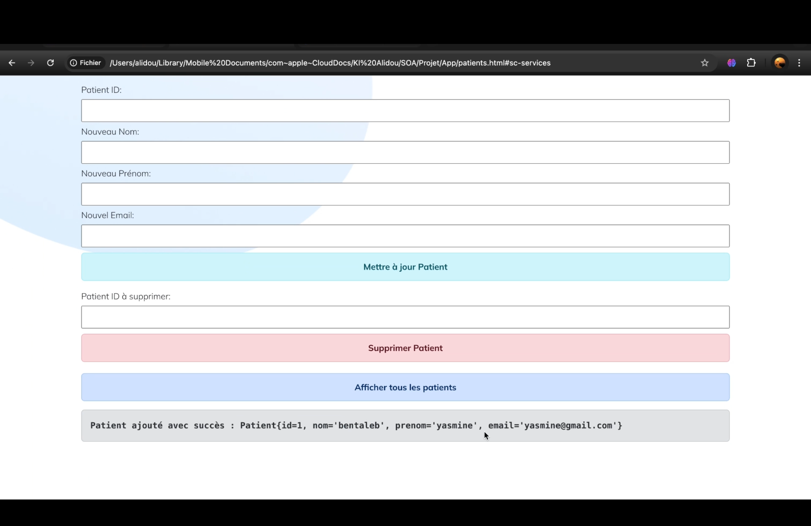
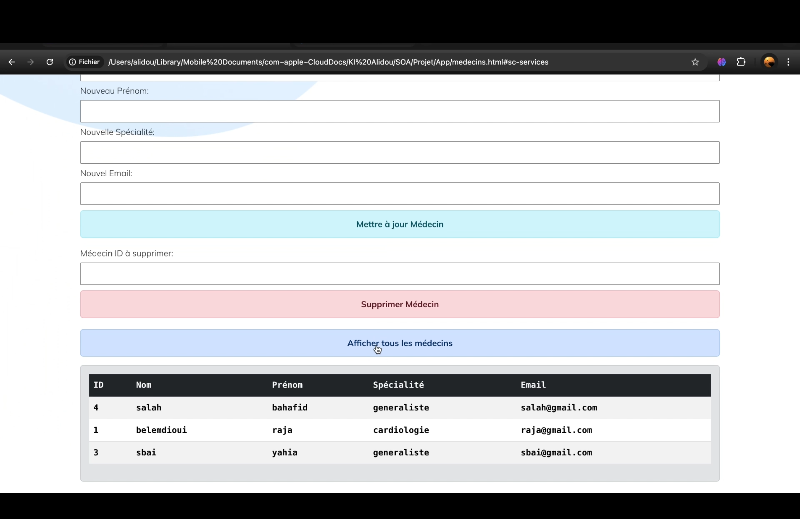
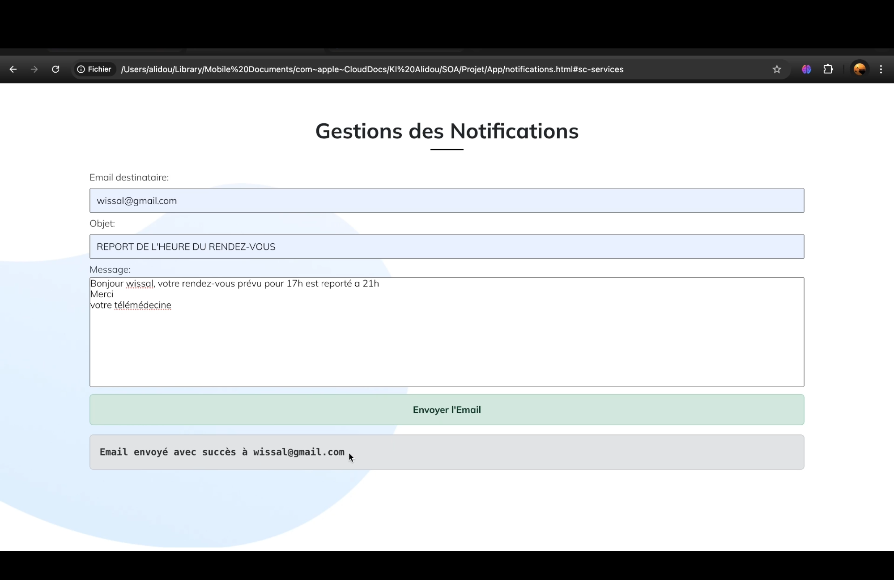

<div align="left"> <a href="./README.md">🇫🇷 Français</a> | <a href="./README.en.md">🇬🇧 English</a> </div>

---

<a name="top"></a>

<div align="center">
  
  
  
  
  
  
  <h1>SOA Telemedicine Clinic Management Application</h1> 
  <p>Project developed for the Service Oriented Architecture (SOA) module — Management of appointments, medical records, prescriptions, doctors, notifications, and patient follow-up.</p>
</div>

# [Demo Video](https://drive.google.com/file/d/16vmIgzZ3hDcO7jv7JHTnSts2dxmiRWFw/view?usp=sharing)
If the link doesn't work, please copy and paste it into your browser's address bar.

# [Report](https://drive.google.com/file/d/1l2pLChcDsLKM7mcFlVI1TMBrnPrlBmQI/view?usp=sharing)
If the link doesn't work, please copy and paste it into your browser's address bar.

## Table of Contents
1. [Introduction](#introduction)
2. [Key Features](#features)
3. [Technologies Used](#tech)
4. [Architecture](#architecture)
5. [Installation](#installation)
6. [Tests and Demonstrations](#demo)
7. [Future Improvements](#future)
8. [Application Demo](#app)

---

## Introduction<a name="introduction"></a>
This project aims to design a comprehensive information system for **managing a telemedicine clinic**, based on a **service-oriented architecture (SOA)**.  
It integrates **3 SOAP services** (medical records management, prescriptions, doctors) and **3 REST services** (appointment management, notifications, patient follow-up), orchestrated via a **BPMN process**.

The system enables:
- Complete management of patient data, doctors, prescriptions, and appointments
- Automated notification (email) sending
- Visualization of consultation history and reports
- Seamless orchestration between services via Redis

<div align="right">
  <a href="#top">⬆ Back to top</a>
</div>

---

## Key Features<a name="features"></a>

### 🧑‍⚕ SOAP Management
- **Patients**: Add, modify, delete, view
- **Doctors**: Add, modify, delete, view
- **Medical records**: Create, modify, delete, consult
- **Prescriptions**: Add, view
- **Medical reports**: Create, modify, delete

### 🌐 REST Management
- **Appointments**: Schedule, view, cancel
- **Notifications**: Email sending (confirmation, modification)
- **Patient follow-up**: Consultation history, reports, status changes

### ⚙️ BPMN Orchestration
- Doctor availability verification
- Automatic record creation for new patients
- Automated email sending
- Follow-up updates after each consultation

<div align="right">
  <a href="#top">⬆ Back to top</a>
</div>

---

## Technologies Used<a name="tech"></a>

<div align="center">
  
  
  
  
  
  
</div>

- **Frontend**: HTML, CSS, JavaScript
- **Backend**: Java 8, Spring Boot 2.7
- **In-memory database**: Redis via Jedis
- **Business process**: Bonita BPM (BPMN)
- **API testing tools**: SOAPUI, Postman
- **Email simulation**: Mailtrap

---

## Architecture<a name="architecture"></a>
- **Config Package**: CORS & SMTP configurations
- **Jedis Package**: Shared data management between SOAP & REST
- **REST Package**: Controllers, services and models for appointments, notifications, follow-up
- **SOAP Package**: Entities, interfaces, implementations for records, patients, doctors, prescriptions
- **Application**: SOAP services (port 8080) and REST services (port 8081) launched together

<div align="right">
  <a href="#top">⬆ Back to top</a>
</div>

---

## Installation<a name="installation"></a>

### Prerequisites
- Java 8+
- Redis installed and configured
- Java IDE (IntelliJ / Eclipse)
- Bonita BPM (for BPMN process)

### Steps
1. **Install prerequisites** (Java, Redis, Bonita BPM)
2. **Launch Redis server**:
   ```bash
   redis-server
   ```
2. **Open Java project** in your IDE
3. **Start the application**
4. **Access frontend** locally via a browser
5. **Test** using:
   - **SOAPUI** for SOAP services
   - **Postman** for REST services

---

## Tests and Demonstrations<a name="demo"></a>
- **SOAPUI**: Testing SOAP operations (patients, doctors, prescriptions...)
- **Postman**: Testing REST endpoints (appointments, notifications, follow-up)
- **Frontend**: Simple forms to interact with services
- **Mailtrap**: Simulating confirmation email sending

---

## Future Improvements<a name="future"></a>
1. More ergonomic frontend interface (**React**, **Angular**)
2. Enhanced security (**JWT**, **OAuth2**)
3. **SMS** management in addition to emails
4. **Cloud deployment** (AWS, Azure)
5. Integration of a **persistent database** (MySQL/PostgreSQL)
6. **WebSocket** integration for real-time notifications

<div align="right">
  <a href="#top">⬆ Back to top</a>
</div>

---

## Application Demo<a name="app"></a>









<div align="right">
  <a href="#top">⬆ Back to top</a>
</div>
