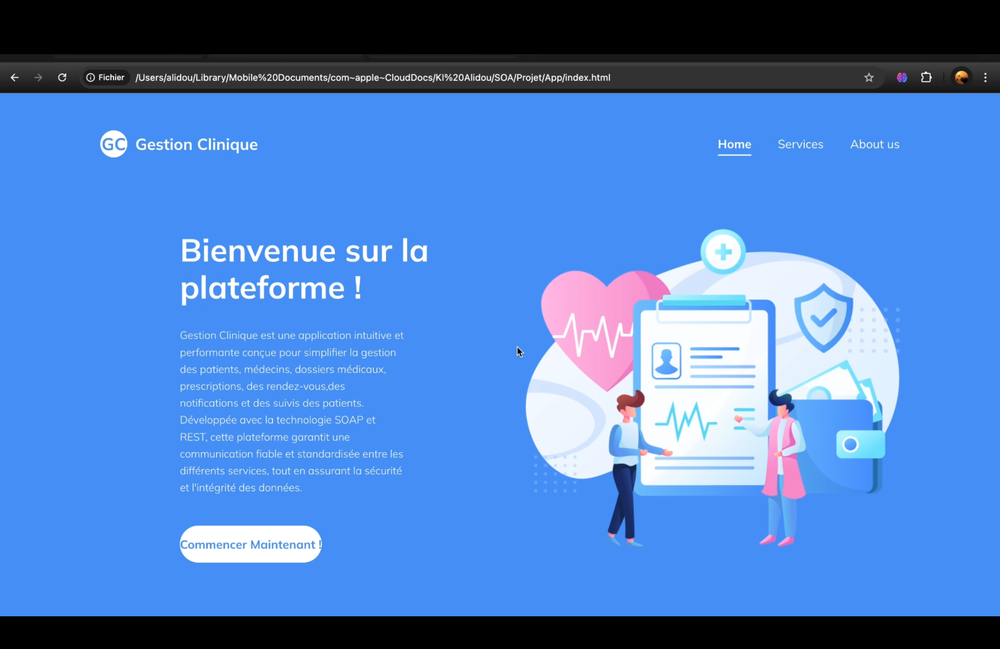
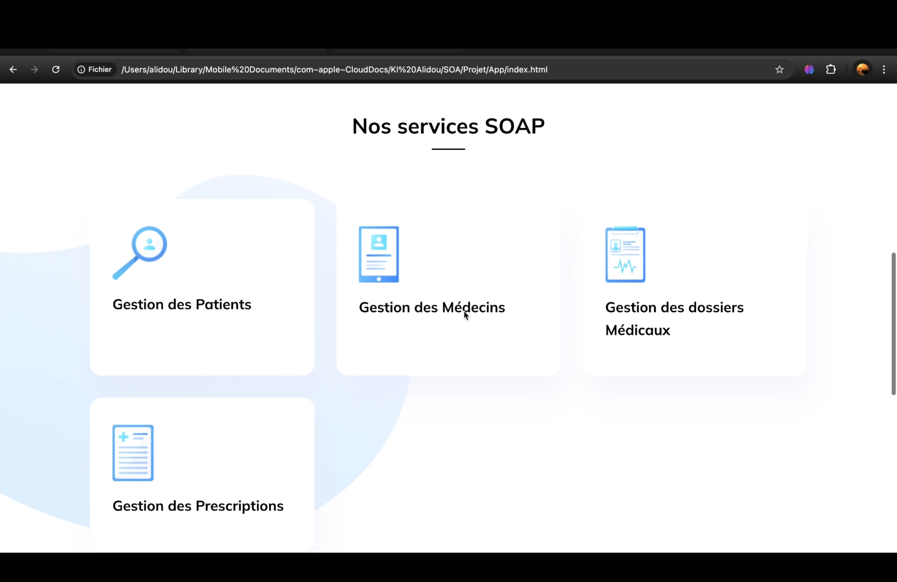
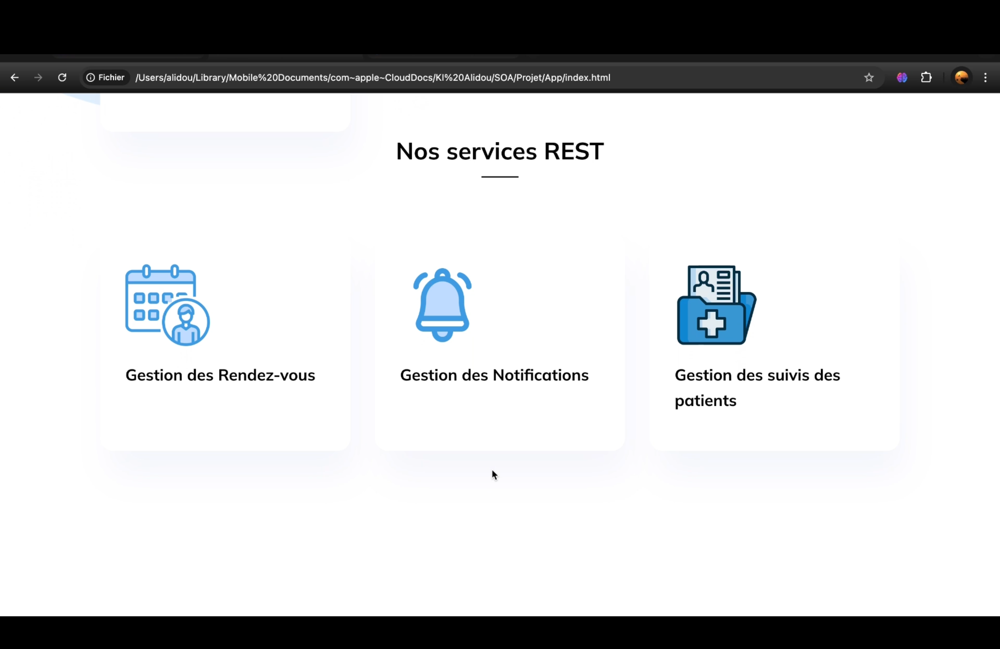
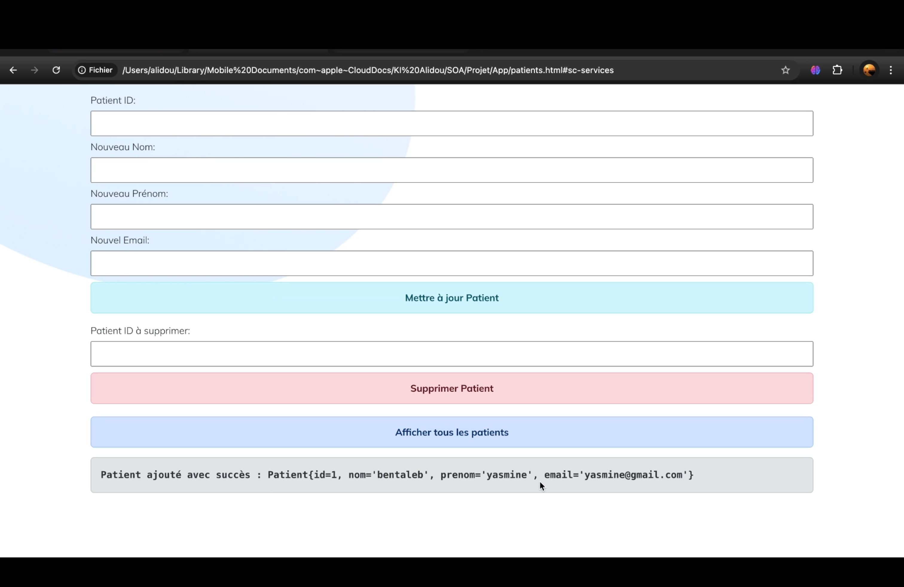
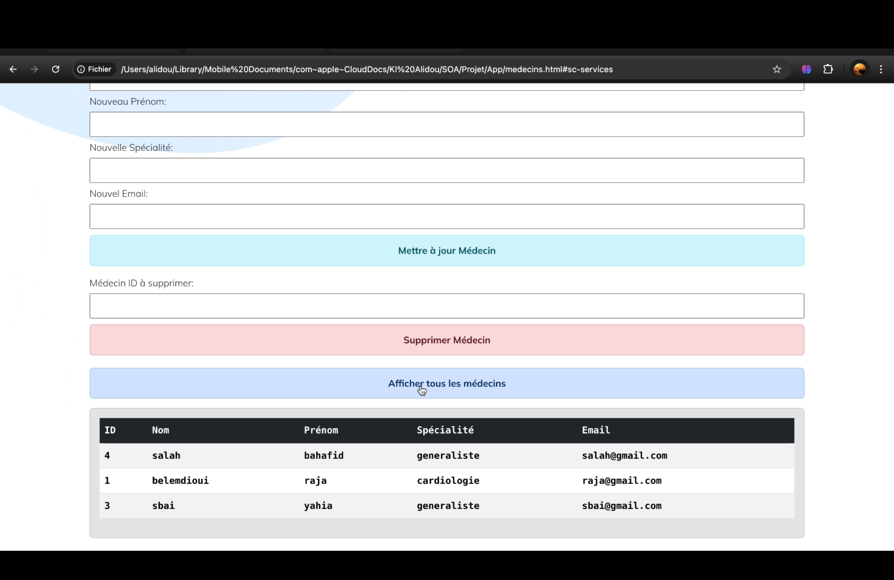
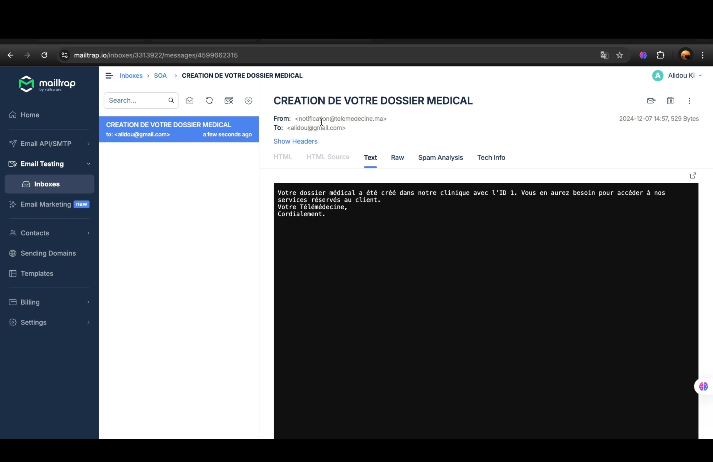
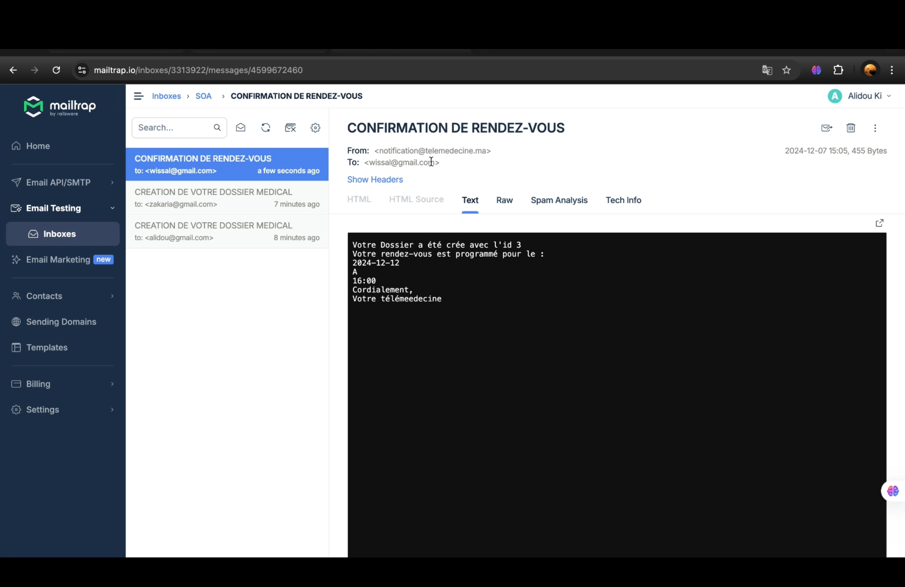
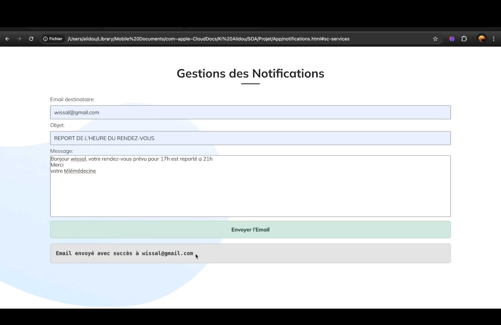
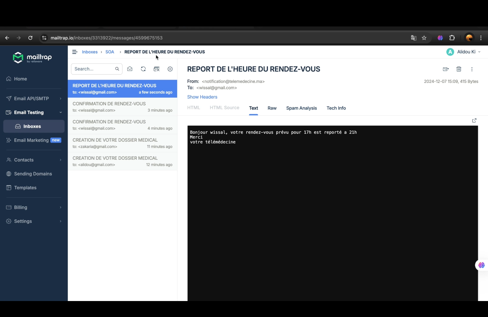
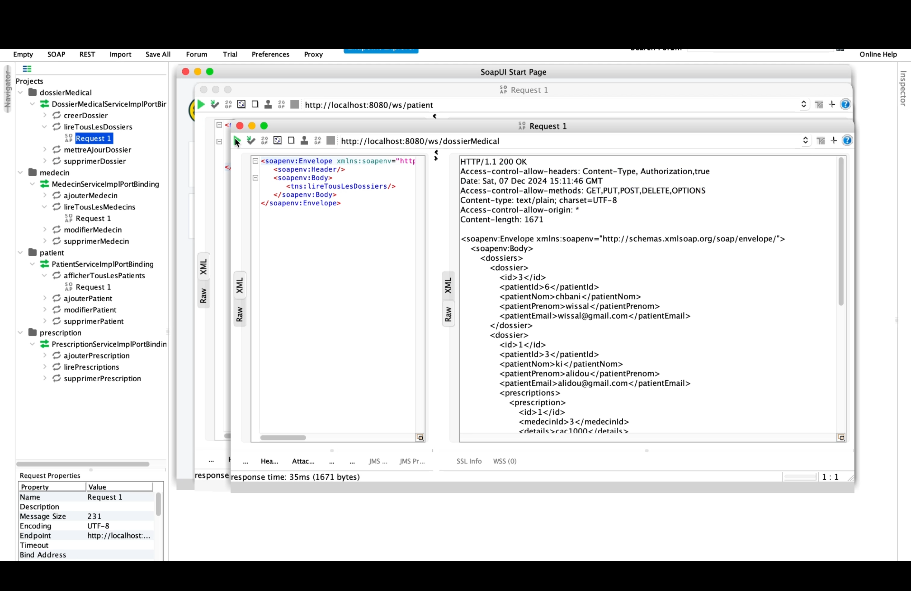

<div align="left"> <a href="./README.md">🇫🇷 Français</a> | <a href="./README.en.md">🇬🇧 English</a> </div>

---

<a name="top"></a>

<div align="center">
  
  
  
  
  
  
  <h1>Application SOA de Gestion d'une Clinique de Télémédecine</h1> 
  <p>Projet réalisé dans le cadre du module Service Oriented Architecture (SOA) — Gestion des rendez-vous, dossiers médicaux, prescriptions, médecins, notifications et suivi des patients.</p>
</div>

# [Video Démonstration](https://drive.google.com/file/d/1p6kfkWYCBZsjH0PLqSy-tZD9gWpFe-_K/view?usp=sharing)
Si le lien ne marche pas, considérez de copier lien et de le coller dans la barre de recherche.

# [Rapport](https://drive.google.com/file/d/1l2pLChcDsLKM7mcFlVI1TMBrnPrlBmQI/view?usp=sharing)
Si le lien ne marche pas, considérez de copier lien et de le coller dans la barre de recherche.

## Table des Matières
1. [Introduction](#introduction)
2. [Fonctionnalités Clés](#features)
3. [Technologies Utilisées](#tech)
4. [Architecture](#architecture)
5. [Installation](#installation)
6. [Tests et Démonstrations](#demo)
7. [Améliorations Futures](#future)
8. [Démo de l'application](#app)

---

## Introduction<a name="introduction"></a>
Ce projet a pour objectif de concevoir un système d'information complet pour la **gestion d'une clinique de télémédecine**, en s'appuyant sur une **architecture orientée services (SOA)**.  
Il intègre **3 services SOAP** (gestion des dossiers médicaux, prescriptions, médecins) et **3 services REST** (gestion des rendez-vous, notifications, suivi des patients), orchestrés via un **processus BPMN**.

Le système permet :
- La gestion complète des données patients, médecins, prescriptions et rendez-vous.
- L’envoi de notifications (e-mail) automatisées.
- La visualisation de l’historique des consultations et rapports.
- Une orchestration fluide entre services via Redis.

<div align="right">
  <a href="#top">⬆ Retour en haut</a>
</div>

---

## Fonctionnalités Clés<a name="features"></a>

### 🧑‍⚕ Gestion SOAP
- **Patients** : Ajouter, modifier, supprimer, afficher.
- **Médecins** : Ajouter, modifier, supprimer, afficher.
- **Dossiers médicaux** : Créer, modifier, supprimer, consulter.
- **Prescriptions** : Ajouter, afficher.
- **Rapports médicaux** : Créer, modifier, supprimer.

### 🌐 Gestion REST
- **Rendez-vous** : Prendre, consulter, annuler.
- **Notifications** : Envoi d’e-mails (confirmation, modification).
- **Suivi des patients** : Historique des consultations, rapports, changement de statut.

### ⚙️ Orchestration BPMN
- Vérification de disponibilité médecin.
- Création automatique de dossier pour nouveau patient.
- Envoi d'e-mails automatiques.
- Mise à jour du suivi après chaque consultation.

<div align="right">
  <a href="#top">⬆ Retour en haut</a>
</div>

---

## Technologies Utilisées<a name="tech"></a>

<div align="center">
  
  
  
  
  
  
</div>

- **Frontend** : HTML, CSS, JavaScript
- **Backend** : Java 8, Spring Boot 2.7
- **Base de données en mémoire** : Redis via Jedis
- **Processus métier** : Bonita BPM (BPMN)
- **Outil de test d’API** : SOAPUI, Postman
- **Simulation d’e-mails** : Mailtrap

---

## Architecture<a name="architecture"></a>
- **Package Config** : Configurations CORS & SMTP.
- **Package Jedis** : Gestion des données partagées entre SOAP & REST.
- **Package REST** : Contrôleurs, services et modèles pour rendez-vous, notifications, suivi.
- **Package SOAP** : Entités, interfaces, implémentations pour dossiers, patients, médecins, prescriptions.
- **Application** : Services SOAP (port 8080) et REST (port 8081) lancés ensemble.

<div align="right">
  <a href="#top">⬆ Retour en haut</a>
</div>

---

## Installation<a name="installation"></a>

### Prérequis
- Java 8+
- Redis installé et configuré
- IDE Java (IntelliJ / Eclipse)
- Bonita BPM (pour le processus BPMN)

### Étapes
1. **Installer les prérequis** (Java, Redis, Bonita BPM).
2. **Lancer le serveur Redis** :
   ```bash
   redis-server
   ```
3. **Ouvrir le projet Java** dans votre IDE.
4. **Démarrer l'application**.
5. **Accéder au frontend** en local via un navigateur.
6. **Tester** via :
   - **SOAPUI** pour les services SOAP.
   - **Postman** pour les services REST.

---

## Tests et Démonstrations<a name="demo"></a>
- **SOAPUI** : Tests des opérations SOAP (patients, médecins, prescriptions…).
- **Postman** : Tests des endpoints REST (rendez-vous, notifications, suivi).
- **Frontend** : Formulaires simples pour interagir avec les services.
- **Mailtrap** : Simulation d’envoi d’e-mails de confirmation.

---

## Améliorations Futures<a name="future"></a>
1. Interface frontend plus ergonomique (**React**, **Angular**).
2. Sécurité renforcée (**JWT**, **OAuth2**).
3. Gestion **SMS** en plus des e-mails.
4. Déploiement **cloud** (AWS, Azure).
5. Intégration d’une **base de données persistante** (MySQL/PostgreSQL).
6. Intégration de **WebSocket** pour notifications temps réel.

<div align="right"> <a href="#top">⬆ Retour en haut</a> </div>

---

## Démo de l'application<a name="app"></a>

## Démo<a name="demo"></a>












<div align="right"> <a href="#top">⬆ Retour en haut</a> </div>
